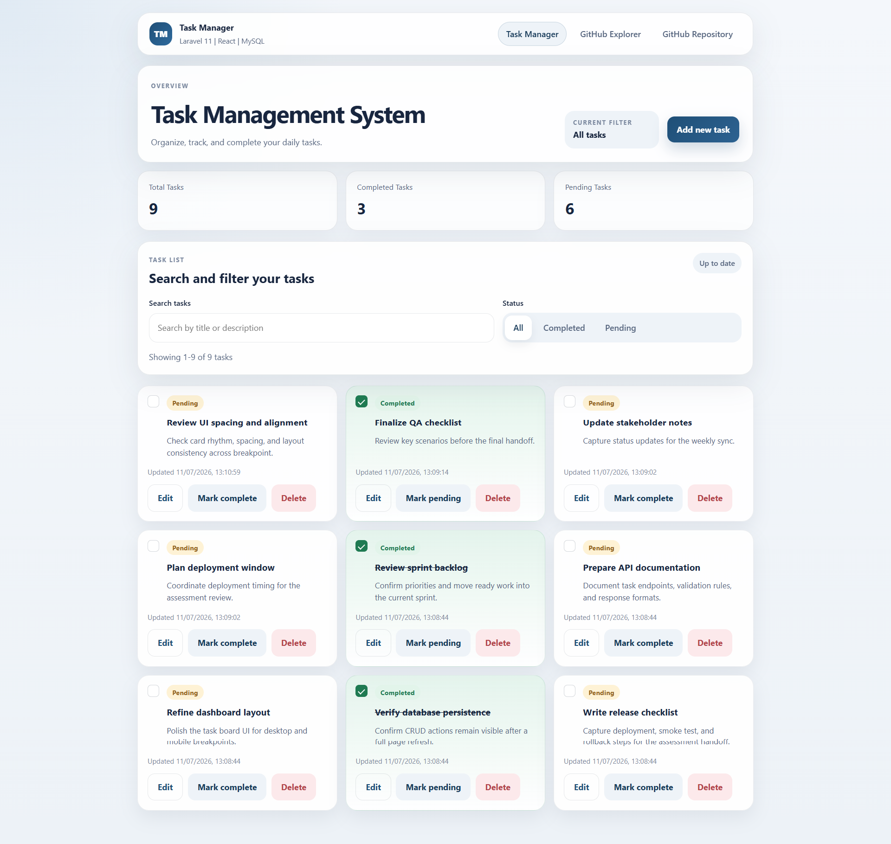
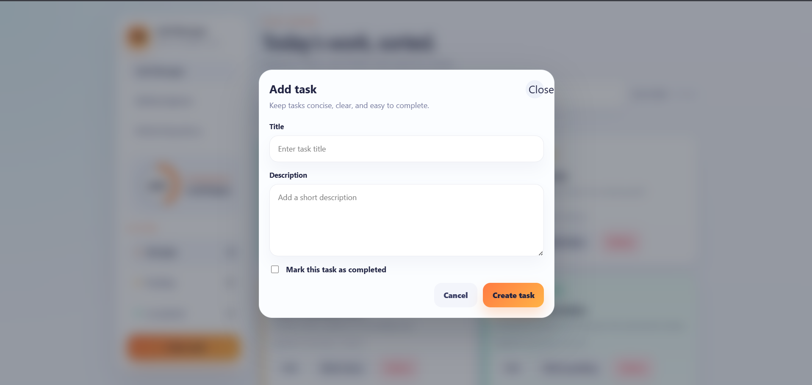
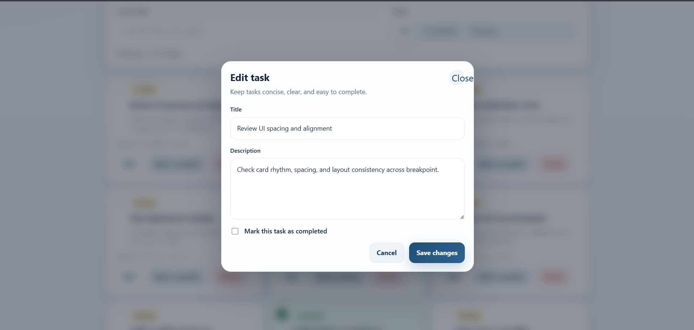
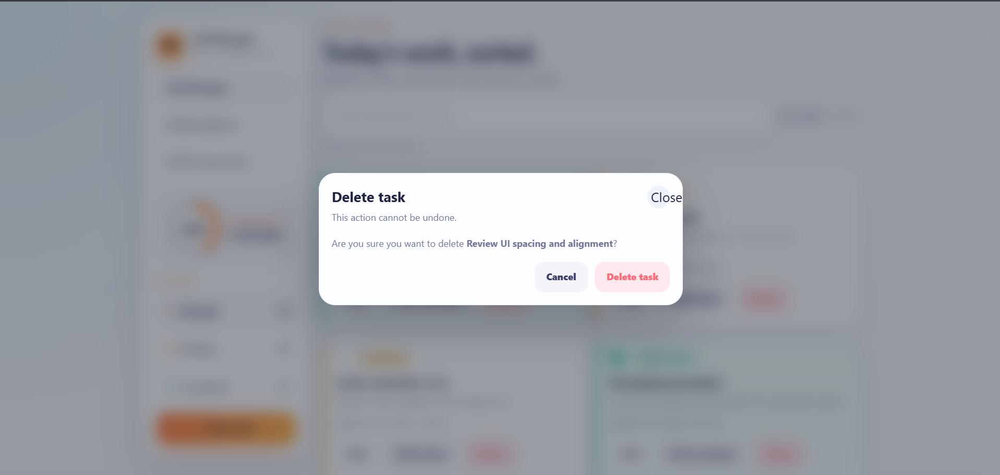
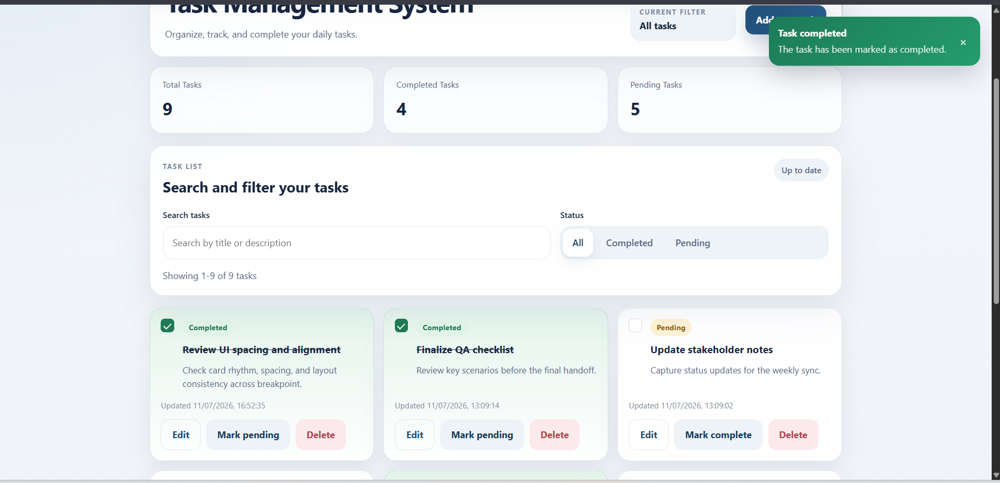
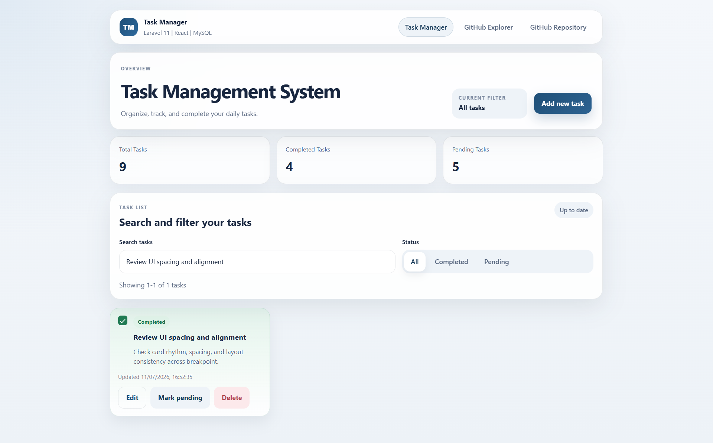
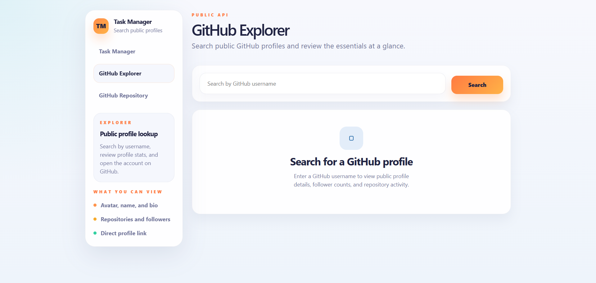
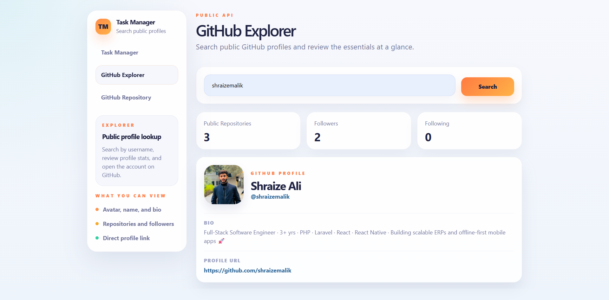
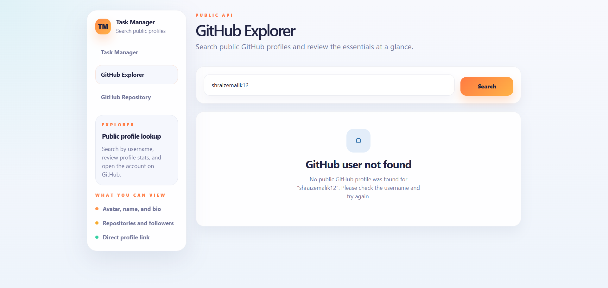

# Task Management System


## Project Overview

Task Management System is a Full Stack Developer assessment project built with Laravel 11, React, MySQL, REST APIs, and GitHub Public API integration. It combines a Laravel backend for task management with a React frontend that handles task workflows and a separate GitHub Explorer page for public profile search.

The project is intentionally structured like a practical technical submission rather than a prototype. The backend emphasizes clear request validation, consistent API responses, modular task logic, and test coverage. The frontend emphasizes responsive layout, reusable components, maintainable state management, and a clean user flow between the task module and the GitHub Explorer feature.

## Features

- Add, edit, delete, and complete tasks
- Search tasks by title or description
- Filter tasks by all, completed, or pending status
- Paginate task results with latest items first
- Responsive interface for desktop and mobile
- Loading, empty, validation, and error states
- Delete confirmation dialog and success or error notifications
- GitHub user search by username
- GitHub profile statistics including repositories, followers, and following

## Technology Stack

- Laravel 11
- PHP 8.2+
- React with Vite
- MySQL
- Axios
- GitHub Public API

## Project Architecture

```text
React Frontend
      ↓
Axios
      ↓
Laravel REST API
      ↓
MySQL Database
```

## Repository Structure

```text
iqt-fullstack-assessment/
├─ backend/
│  ├─ app/
│  ├─ database/
│  ├─ routes/
│  ├─ tests/
│  └─ .env.example
├─ frontend/
│  ├─ src/
│  ├─ public/
│  └─ .env.example
├─ docs/
│  ├─ api-documentation.md
│  ├─ database-schema.md
│  ├─ installation-guide.md
│  └─ project-architecture.md
└─ README.md
```

- `backend/` contains the Laravel 11 REST API, task domain code, migrations, seeders, and tests.
- `frontend/` contains the React + Vite client, reusable UI components, task pages, and GitHub Explorer page.
- `docs/` contains supporting technical documentation for installation, schema, API behavior, and architecture notes.

## Installation Guide

### 1. Clone the repository

Update this placeholder before sharing the project publicly:

```bash
git clone <YOUR_REPOSITORY_URL>
cd iqt-fullstack-assessment
```

### 2. Backend setup

The recommended Laravel setup order for this project is:

1. Copy the environment file
2. Install Composer dependencies
3. Generate the application key
4. Configure the database
5. Run migrations and seeders
6. Start the development server

#### Windows

```bash
cd backend
copy .env.example .env
composer install
php artisan key:generate
```

#### Linux/macOS

```bash
cd backend
cp .env.example .env
composer install
php artisan key:generate
```

After that, update `backend/.env` with your local MySQL settings.

### 3. Database creation

Create a MySQL database named `task_management_system`, or choose a different name and update `DB_DATABASE` in `backend/.env`.

Example backend database configuration:

```env
DB_CONNECTION=mysql
DB_HOST=127.0.0.1
DB_PORT=3306
DB_DATABASE=task_management_system
DB_USERNAME=root
DB_PASSWORD=
```

### 4. Run migrations and seeders

```bash
php artisan migrate --seed
```

This seeds realistic sample tasks used by the Task Manager interface.

### 5. Start the Laravel backend

```bash
php artisan serve
```

The backend runs by default at `http://127.0.0.1:8000`.

### 6. Frontend setup

Open a second terminal window.

#### Windows

```bash
cd frontend
copy .env.example .env
npm install
```

#### Linux/macOS

```bash
cd frontend
cp .env.example .env
npm install
```

Then update the frontend environment values if needed:

```env
VITE_API_BASE_URL=http://127.0.0.1:8000/api/v1
VITE_REPOSITORY_URL=<YOUR_PUBLIC_REPOSITORY_URL>
```

### 7. Start the React frontend

```bash
npm run dev
```

The frontend runs by default at `http://127.0.0.1:5173`.

## Environment Variables

### Backend

Main backend variables used by this project:

- `APP_NAME`
- `APP_ENV`
- `APP_KEY`
- `APP_DEBUG`
- `APP_URL`
- `DB_CONNECTION`
- `DB_HOST`
- `DB_PORT`
- `DB_DATABASE`
- `DB_USERNAME`
- `DB_PASSWORD`

### Frontend

- `VITE_API_BASE_URL`  
  Base URL for the Laravel API, for example `http://127.0.0.1:8000/api/v1`
- `VITE_REPOSITORY_URL`  
  External repository link displayed in the top navigation

## Database Schema

The project uses a single `tasks` table with these fields:

- `id`
- `title`
- `description`
- `is_completed`
- `created_at`
- `updated_at`

The schema also includes indexes on `is_completed` and `created_at` to support filtering and latest-first retrieval efficiently.

## REST API Documentation

Base route: `/api/v1`

### `GET /api/v1/tasks`

Returns a paginated list of tasks ordered by latest first.

Supported query parameters:

- `search`
- `status=completed|pending`
- `per_page`
- `page`

Example request:

```http
GET /api/v1/tasks?search=api&status=pending&per_page=10&page=1
```

The response includes task records, pagination metadata, and a summary block containing total, completed, pending, and filtered counts.

### `POST /api/v1/tasks`

Creates a new task.

Expected fields:

- `title` required
- `description` nullable
- `is_completed` optional boolean

Example request:

```http
POST /api/v1/tasks
Content-Type: application/json

{
  "title": "Prepare API documentation",
  "description": "Document request and response formats.",
  "is_completed": false
}
```

### `PUT /api/v1/tasks/{id}`

Updates an existing task by ID.

### `DELETE /api/v1/tasks/{id}`

Deletes a task by ID.

## Public API Integration

The GitHub Explorer page uses the official GitHub Users API:

- Endpoint pattern: `https://api.github.com/users/{username}`

Users can search by GitHub username and view:

- Avatar
- Full name
- Username
- Bio
- Public repositories
- Followers
- Following
- Profile URL

The page handles initial state, empty input, loading state, not-found responses, and general API errors without affecting Task Manager behavior.

## Testing & Verification

Backend tests:

```bash
cd backend
php artisan test
```

Frontend lint:

```bash
cd frontend
npm run lint
```

Frontend production build:

```bash
cd frontend
npm run build
```

## Screenshots

The screenshots below demonstrate the main task management workflows and GitHub API integration.

### Task Manager Overview



### Add Task



### Edit Task



### Delete Confirmation



### Completed Task



### Task Search Results



### GitHub Explorer Overview



### GitHub User Search Result



### GitHub User Not Found



## Security Notes

Environment files such as `.env` should never be committed because they can contain application keys, database credentials, and environment-specific configuration. This repository uses `.env.example` files to document required settings safely. Each reviewer or developer should create their own local `.env` file based on the example files before running the project.
